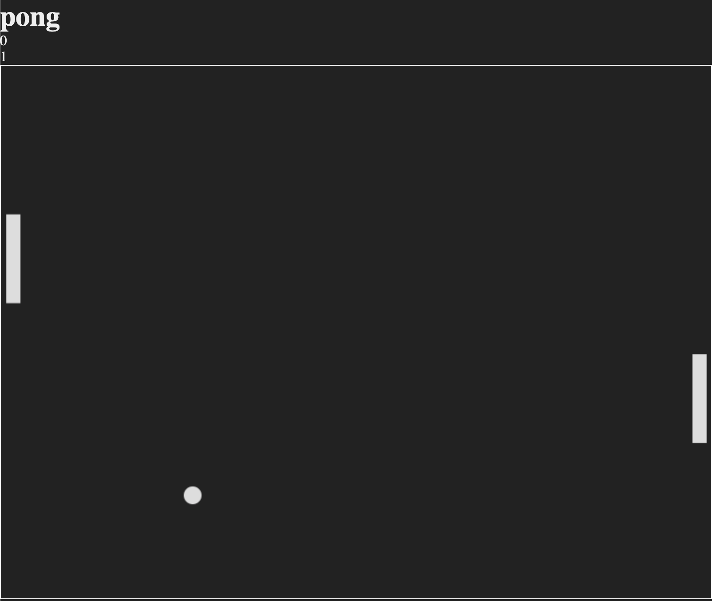

# [Note](https://ahhchooey.github.io/pong/dist)

------

### Tech Stack

* Javascript
* HTML5
* Canvas

------

This is a recreation of Pong for 2 players. Simply move the paddles to bounce the ball!



### How It Works
------
1. Pong is built with HTML5, CSS, and Canvas.
2. It is a simple frontend only application that is writen in Javascript and bundled with Webpack.

### How To Use
------
To play just click START.
Q and A moves the left paddle. Up and Down Arrows move the right paddle.
ESC pauses and resumes the game.
Thats it! First player to 10 points wins!

### Example Code
------

An example for paddle/ball collision.
```js
let paddleOneRight = this.paddleOne.position.x + this.paddleOne.width;
let paddleOneTop = this.paddleOne.position.y;
let paddleOneBottom = this.paddleOne.position.y + this.paddleOne.height;
let paddleTwoLeft = this.paddleTwo.position.x;
let paddleTwoTop = this.paddleTwo.position.y;
let paddleTwoBottom = this.paddleTwo.position.y + this.paddleTwo.height;

if (this.position.x > paddleTwoLeft &&
  this.position.y < paddleTwoBottom &&
  this.position.y > paddleTwoTop) {
  this.bounceHoriztontal(this.paddleTwo)
};

if (this.position.x < paddleOneRight &&
  this.position.y < paddleOneBottom &&
  this.position.y > paddleOneTop) {
  this.bounceHoriztontal(this.paddleOne)
};

if (this.position.x < 0 - this.diameter) {
  this.playerTwoScore++;
  this.resetBall();
};

if (this.position.x > this.fieldWidth + this.diameter) {
  this.playerOneScore++;
  this.resetBall();
};
```
